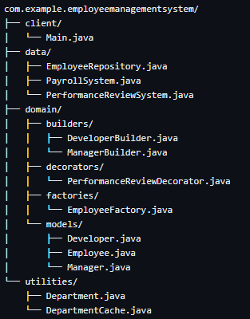
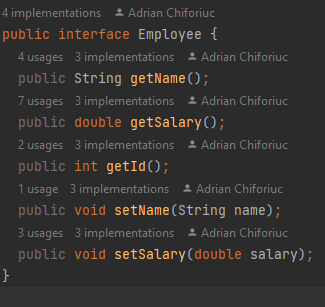
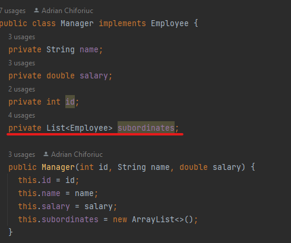
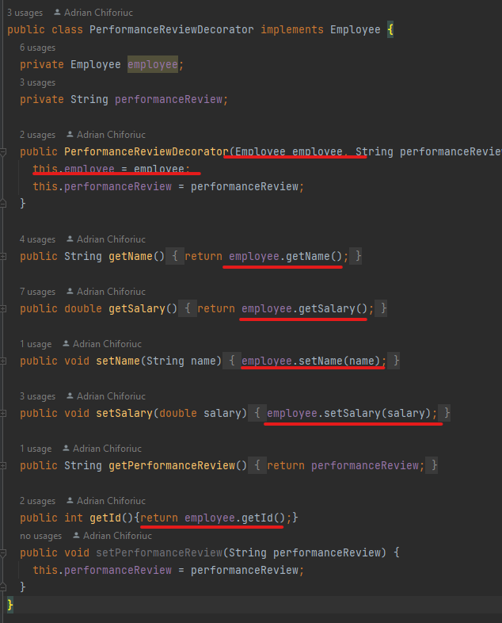
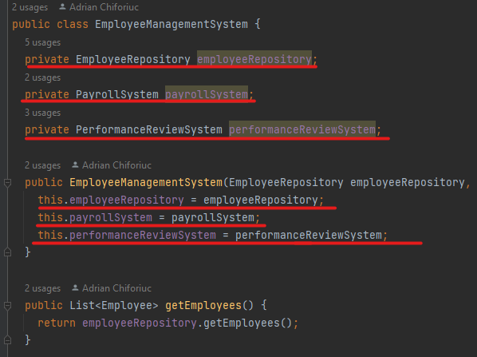
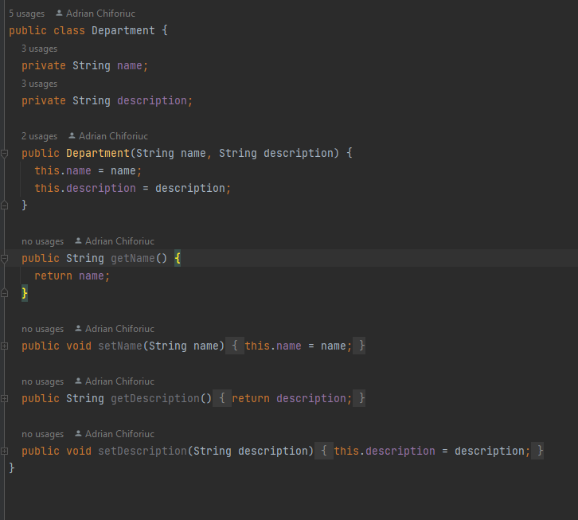
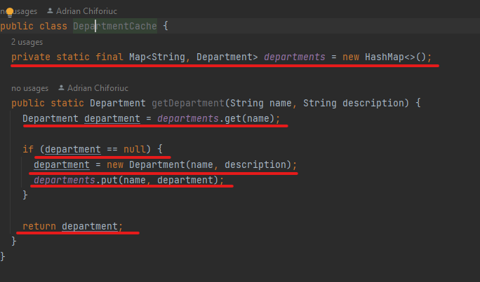

# About the app
The Employee Management System project is a software application that allows users to manage
employees in a company. It uses various design patterns such as the Composite pattern for
creating employee hierarchies, the Decorator pattern for adding additional functionality
to employee objects, the Facade pattern for providing a simplified interface to the system,
and the Flyweight pattern for reducing memory usage by sharing common data between objects.
The system allows users to add, remove, and update employee data, perform performance reviews,
and pay employees.

## The app structure

## Design Patterns
### Composite
The Employee interface and Manager class implement the composite pattern, 
where a manager can have a list of employees and can also be part of a larger employee 
hierarchy.

### Decorator

The PerformanceReviewDecorator class uses the decorator pattern to add 
additional functionality (in this case, performance reviews) to an 
Employee object without modifying its original behavior.

### Facade

The EmployeeManagementSystem class acts as a facade to simplify the interface 
of the system, hiding the complexity of the underlying subsystems such as 
the EmployeeRepository, PayrollSystem, and PerformanceReviewSystem.

### Flyweight

The Department and DepartmentCache classes use the flyweight pattern 
to reduce memory usage by sharing common data between objects.

