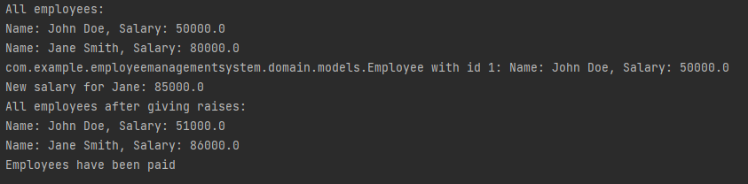

# About the app
The Employee Management System project is a software application that allows users to manage
employees in a company. It uses various design patterns such as the Composite pattern for
creating employee hierarchies, the Decorator pattern for adding additional functionality
to employee objects, the Facade pattern for providing a simplified interface to the system,
and the Flyweight pattern for reducing memory usage by sharing common data between objects.
The system allows users to add, remove, and update employee data, perform performance reviews,
and pay employees.

## Objectives
    1. Study and understand the Structural Design Patterns.
    2. As a continuation of the previous laboratory work, 
    think about the functionalities that your system will need to provide to the user.
    3. Implement some additional functionalities, or create a new project 
    using structural design patterns.

## Used Design patterns
    1.Composite
    2.Decorator
    3.Facade
    4.Flyweight

## The app structure

## Implementation
### Composite
The Employee interface and Manager class implement the composite pattern, 
where a manager can have a list of employees and can also be part of a larger employee 
hierarchy.

### Decorator

The PerformanceReviewDecorator class uses the decorator pattern to add 
additional functionality (in this case, performance reviews) to an 
Employee object without modifying its original behavior.

### Facade

The EmployeeManagementSystem class acts as a facade to simplify the interface 
of the system, hiding the complexity of the underlying subsystems such as 
the EmployeeRepository, PayrollSystem, and PerformanceReviewSystem.

### Flyweight

The Department and DepartmentCache classes use the flyweight pattern 
to reduce memory usage by sharing common data between objects.

### Result after execution

### Conclusion
The Employee Management System project is an example of how various 
design patterns can be used to create a robust, scalable, 
and maintainable software application for managing employees in a 
company. The project demonstrates the use of the Composite pattern for
creating employee hierarchies, the Decorator pattern for adding
additional functionality to employee objects, the Facade pattern for 
providing a simplified interface to the system, and the Flyweight 
pattern for reducing memory usage by sharing common data between 
objects. These patterns help to improve the overall design of the 
system, making it more flexible, extensible, and easier to maintain.